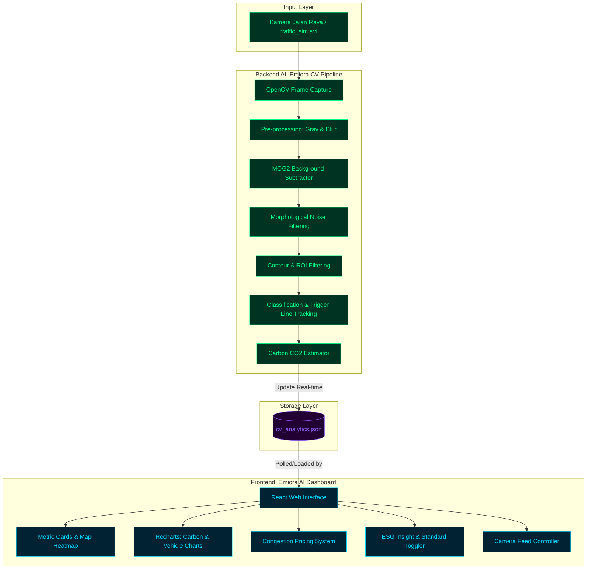

# 📊 Dokumentasi Visualisasi Sistem Emiora AI

Dokumen ini berisi visualisasi **Grand Design**, **Use Case**, dan **Activity Diagrams** untuk fitur-fitur inti (core features) dari proyek **Emiora AI Dashboard** dan backend computer vision **Emiora AI Pipeline**.


Diagram dibuat menggunakan format **Mermaid.js** agar interaktif, mudah diperbarui, dan beresolusi tinggi di dalam repositori.


---

## 🏗️ 1. Arsitektur Sistem Global

Diagram blok di bawah ini menggambarkan aliran data sistem secara keseluruhan, mulai dari input video jalan raya, pemrosesan AI secara real-time, hingga visualisasi interaktif pada dashboard web.



---

## 🎯 2. Use Case Diagram

Diagram ini memetakan interaksi antara pengguna (**Operator Lalu Lintas** dan **Auditor ESG**), **Sistem AI (Emiora Pipeline)** sebagai aktor sistem, dan fitur-fitur utama di dalam aplikasi.


```mermaid
leftToRightDirection
actor Operator as "👷 Operator Lalu Lintas"
actor ESG as "🌱 Auditor ESG / Analis Lingkungan"
actor AI as "🤖 Emiora AI Pipeline (Sistem)"

rectangle Emiora_AI_Dashboard {
    usecase UC1 as "Melihat Dashboard & Metrik Real-Time"
    usecase UC2 as "Memantau Kamera Pengawas (Live Camera)"
    usecase UC3 as "Mengaktifkan/Nonaktifkan Feed Kamera"
    usecase UC4 as "Melihat Heatmap Kemacetan & Jenis Kendaraan"
    usecase UC5 as "Menganalisis Emisi Karbon CO2"
    usecase UC6 as "Mengubah Standar Emisi (Euro vs. EPA)"
    usecase UC7 as "Menghitung & Mengatur Congestion Pricing"
    usecase UC8 as "Melihat Rekomendasi & ESG Insights"
    usecase UC9 as "Menyusun Laporan & Laporan Sistem"
    usecase UC10 as "Melakukan Deteksi Objek & Klasifikasi Otomatis"
    usecase UC11 as "Menghitung Estimasi CO2 secara Real-Time"
}

Operator --> UC1
Operator --> UC2
Operator --> UC3
Operator --> UC4
Operator --> UC7
Operator --> UC9

ESG --> UC1
ESG --> UC5
ESG --> UC6
ESG --> UC8
ESG --> UC9

AI --> UC10
AI --> UC11
UC10 -.->|include| UC11
UC11 -.->|provides data to| UC1
UC11 -.->|provides data to| UC5
```

---

## 🔄 3. Activity Diagrams (Aliran Aktivitas Fitur Utama)

Aktivitas sistem dibagi menjadi 3 proses inti: Pemrosesan AI Backend, Manajemen Dashboard Frontend, dan Kalkulasi Tarif Kemacetan (Congestion Pricing).


### 🎬 Aktivitas A: Pemrosesan Video & Klasifikasi Kendaraan (Emiora AI Pipeline)
Menjelaskan langkah demi langkah bagaimana AI membaca data lalu lintas secara real-time dari tangkapan kamera lalu mengubahnya menjadi metrik emisi karbon.

```mermaid
title Activity Diagram: Emiora AI Core Pipeline
stateDiagram-v2
    [*] --> Start_Pipeline : Inisialisasi Pipeline
    Start_Pipeline --> Check_Video_Source : Load video 'traffic_sim.avi'
    
    state Check_Video_Source {
        [*] --> Check_Exist
        Check_Exist --> Video_Exists : Ya
        Check_Exist --> Generate_Video : Tidak (Buat traffic_sim.avi)
        Generate_Video --> Video_Exists
    }
    
    Video_Exists --> Init_JSON_Analytics : Set cv_analytics.json ke default (active)
    Init_JSON_Analytics --> Read_Frame : Baca Frame dari Video
    
    state Read_Frame {
        [*] --> Convert_To_Gray : Ubah ke Grayscale
        Convert_To_Gray --> Apply_Gaussian_Blur : Reduksi Noise (Blur 5x5)
        Apply_Gaussian_Blur --> Apply_MOG2 : Background Subtraction (Tinggalkan Objek Bergerak)
        Apply_MOG2 --> Morphological_Clean : Dilate & Close (Menghubungkan bagian kendaraan)
        Morphological_Clean --> Find_Contours : Deteksi Kontur Objek
    }
    
    Find_Contours --> Iterate_Contours : Loop Setiap Kontur Terdeteksi
    
    state Iterate_Contours {
        [*] --> Check_Contour_Area : Apakah Area Kontur > 300 px?
        Check_Contour_Area --> Skip_Noise : Tidak (Abaikan)
        Check_Contour_Area --> Check_ROI : Ya, Apakah berada dalam batas jalan (Y: 80-400)?
        Check_ROI --> Out_Of_Bounds : Tidak (Abaikan)
        Check_ROI --> Classify_Vehicle : Ya
        
        state Classify_Vehicle {
            [*] --> Dimension_Check
            Dimension_Check --> Classify_Motorcycle : Lebar < 30 & Tinggi < 15
            Dimension_Check --> Classify_Heavy : Lebar > 65 & Tinggi > 20
            Dimension_Check --> Classify_Car : Default (Mobil Standar)
            
            Classify_Heavy --> Classify_Truck : Lebar > 75 (Truk)
            Classify_Heavy --> Classify_Bus : Lebar <= 75 (Bus)
        }
    }
    
    state Tracking_And_Emission {
        [*] --> Create_Unique_ID : Buat ID berdasarkan Tipe & Posisi Lajur Y
        Create_Unique_ID --> Check_Trigger_Line : Apakah melewati Garis Pemicu X (320-335)?
        Check_Trigger_Line --> No_Action : Tidak
        Check_Trigger_Line --> Check_If_Tracked : Ya, Apakah ID sudah terhitung sebelumnya?
        Check_If_Tracked --> Already_Counted : Ya (Abaikan)
        Check_If_Tracked --> Update_Stats : Belum (Baru Lewat)
        
        state Update_Stats {
            [*] --> Increment_Counter : Tambah jumlah kendaraan [Mobil/Bus/Truk/Motor]
            Increment_Counter --> Add_Carbon_Emission : Tambahkan CO2 sesuai Faktor Emisi (kg/km)
            note right of Add_Carbon_Emission
              Faktor Emisi CO2 per km:
              - Car: 0.12 kg
              - Bus: 0.68 kg
              - Truck: 0.85 kg
              - Motorcycle: 0.05 kg
            end note
        }
    }
    
    Iterate_Contours --> Tracking_And_Emission
    Tracking_And_Emission --> Render_Visual_Overlay : Gambar Bounding Box Neon & Trigger Line
    Render_Visual_Overlay --> Calculate_Congestion_Index : Hitung Indeks Kemacetan (Low/Medium/High)
    Calculate_Congestion_Index --> Export_JSON : Tulis data real-time ke cv_analytics.json
    Export_JSON --> Display_Preview : Tampilkan jendela real-time OpenCV
    Display_Preview --> Check_Termination : Tombol 'q' ditekan?
    Check_Termination --> Read_Frame : Tidak (Lanjutkan ke Frame Berikutnya)
    Check_Termination --> [*] : Ya (Matikan Pipeline secara Aman)
```

---

### 💻 Aktivitas B: Operasi Dashboard & Interaksi Pengguna (Frontend Dashboard)
Menggambarkan alur kerja saat pengguna menjelajahi Dashboard Emiora AI, memantau metrik lalu lintas, serta mengganti standar metrik karbon.

```mermaid
title Activity Diagram: Dashboard Frontend & User Actions
stateDiagram-v2
    [*] --> Load_Dashboard : Pengguna Membuka Web Emiora AI
    Load_Dashboard --> Initialize_State : Set tab default ke 'Dashboard' & Tema 'Dark'
    Initialize_State --> Start_Data_Polling : Poll 'cv_analytics.json' setiap beberapa detik
    
    state Start_Data_Polling {
        [*] --> Fetch_JSON
        Fetch_JSON --> Update_Global_Metrics : Berhasil
        Update_Global_Metrics --> Refresh_Charts : Re-render Komponen Grafik
    }
    
    state Render_View {
        [*] --> Check_Active_Section
        Check_Active_Section --> View_Overview : ActiveSection == 'dashboard'
        Check_Active_Section --> View_Traffic : ActiveSection == 'traffic'
        Check_Active_Section --> View_Carbon : ActiveSection == 'carbon'
        Check_Active_Section --> View_Pricing : ActiveSection == 'pricing'
        Check_Active_Section --> View_Cameras : ActiveSection == 'cameras'
        
        state View_Overview {
            [*] --> Render_Metric_Cards : Total Kendaraan, Level Kemacetan, Emisi Karbon, AI Akurasi
            Render_Metric_Cards --> Sub_Tab_Selection
            Sub_Tab_Selection --> Show_Traffic_Overview : Klik Tab "Traffic Overview"
            Sub_Tab_Selection --> Show_AI_Analytics : Klik Tab "AI & Analytics"
        }
        
        state View_Traffic {
            [*] --> Render_Spatial_Heatmap : Heatmap Kemacetan 2D
            Render_Spatial_Heatmap --> Render_Vehicle_Distribution_Chart : Donut Chart Pembagian Kendaraan
            Render_Vehicle_Distribution_Chart --> Render_AI_Predictions : Tampilkan Prediksi Volume & Akurasi
        }
        
        state View_Carbon {
            [*] --> Render_Carbon_Trends_Chart : Grafik Area Emisi Historis vs Target
            Render_Carbon_Trends_Chart --> Render_ESG_Insights : ESG Score & Rekomendasi Hijau (Odd-Even, EV Lanes)
        }
        
        state View_Pricing {
            [*] --> Render_Congestion_Rates : Tampilkan Tarif Kemacetan Real-Time (Peak/Standard/Eco)
            Render_Congestion_Rates --> Render_Eco_Discounts : Perbandingan Tarif Manual vs Auto-Pricing AI
        }
        
        state View_Cameras {
            [*] --> Render_Cameras_Grid : Tampilkan Grid Kamera 1-6 (Status, Lokasi, Latency)
            Render_Cameras_Grid --> Toggle_Camera_Feed : Operator Mengubah Status Kamera (Active/Inactive)
        }
    }
    
    state User_Interactive_Actions {
        [*] --> Wait_User_Action
        Wait_User_Action --> Toggle_Theme : Klik Tombol Switch Tema (Light/Dark)
        Toggle_Theme --> Apply_CSS_Variables : Ubah Latar Belakang & Aksen Neon
        
        Wait_User_Action --> Switch_Carbon_Standard : Klik Dropdown Standar Metrik (Euro vs EPA)
        Switch_Carbon_Standard --> Recalculate_Emissions : Konversi Satuan Emisi
        note right of Recalculate_Emissions
          - Euro: kg CO2 (Faktor emisi standar)
          - EPA: lbs CO2 (Dikalikan koefisien konversi)
        end note
        Recalculate_Emissions --> Refresh_Charts
    }
    
    Start_Data_Polling --> Render_View
    Render_View --> User_Interactive_Actions
    Apply_CSS_Variables --> Render_View
    Refresh_Charts --> Render_View
```

---

### 💸 Aktivitas C: Mekanisme Congestion Pricing & Regulasi Karbon
Menjelaskan logika otomatis bagaimana sistem menyesuaikan tarif jalan raya berdasarkan tingkat kepadatan lalu lintas dan emisi CO2 yang dideteksi oleh kamera AI.

```mermaid
title Activity Diagram: Congestion Pricing Engine
stateDiagram-v2
    [*] --> Monitor_Live_Traffic : Emiora AI mendeteksi volume kendaraan
    Monitor_Live_Traffic --> Read_Congestion_Level : Tarik data 'congestion_index'
    
    state Read_Congestion_Level {
        [*] --> Check_Index
        Check_Index --> High_Congestion : Index == "High"
        Check_Index --> Medium_Congestion : Index == "Medium"
        Check_Index --> Low_Congestion : Index == "Low"
    }
    
    state Apply_Pricing_Policy {
        High_Congestion --> Peak_Pricing_Rate : Terapkan Tarif Tertinggi (Peak Hours Rate)
        note left of Peak_Pricing_Rate
          Mendorong pengendara untuk mengambil 
          rute alternatif atau menunda perjalanan.
        end note
        
        Medium_Congestion --> Standard_Pricing_Rate : Terapkan Tarif Standar (Normal)
        
        Low_Congestion --> Eco_Pricing_Rate : Terapkan Tarif Termurah (Eco-Discount Rate)
        note right of Eco_Pricing_Rate
          Memberikan diskon bagi kendaraan ramah 
          lingkungan (EV) atau saat emisi CO2 rendah.
        end note
    }
    
    state Check_Vehicle_Type {
        [*] --> Identify_Passing_Vehicle
        Identify_Passing_Vehicle --> Heavy_Vehicle : Truk / Bus
        Identify_Passing_Vehicle --> Personal_Car : Mobil Pribadi
        Identify_Passing_Vehicle --> Motorcycle : Sepeda Motor
    }
    
    state Calculate_Total_Fee {
        Peak_Pricing_Rate --> Apply_Surcharges
        Standard_Pricing_Rate --> Apply_Surcharges
        Eco_Pricing_Rate --> Apply_Surcharges
        
        Heavy_Vehicle --> Apply_Surcharges : Tambah biaya beban jalan & emisi tinggi
        Personal_Car --> Apply_Surcharges : Biaya standar
        Motorcycle --> Apply_Surcharges : Biaya minimal / Diskon
    }
    
    Apply_Surcharges --> Display_Pricing_Scheme : Tampilkan simulasi tarif di Dashboard
    Display_Pricing_Scheme --> Auto_Pricing_Switch : Apakah Mode Auto-Pricing Aktif?
    Auto_Pricing_Switch --> Broadcast_API : Ya (Kirim tarif ke gerbang tol pintar / API)
    Auto_Pricing_Switch --> Wait_Manual_Approval : Tidak (Tunggu persetujuan Operator)
    Wait_Manual_Approval --> Broadcast_API : Operator Menyetujui
    Broadcast_API --> [*]
```

---

## 📂 Lokasi File & Referensi Teknis

Diagram di atas mencerminkan implementasi kode aktif berikut:
- **Konfigurasi Emisi & Pipeline AI**: [pipeline.py](file:///c:/CarbonFlow%20AI%20Dashboard%20Design/ai_pipeline/pipeline.py#L9-L14)
- **Komponen Manajemen Kamera**: [Cameras.tsx](file:///c:/CarbonFlow%20AI%20Dashboard%20Design/src/app/components/Cameras.tsx)
- **Komponen Tarif Kemacetan**: [CongestionPricing.tsx](file:///c:/CarbonFlow%20AI%20Dashboard%20Design/src/app/components/CongestionPricing.tsx)
- **Komponen Analitik Karbon**: [CarbonChart.tsx](file:///c:/CarbonFlow%20AI%20Dashboard%20Design/src/app/components/CarbonChart.tsx)
- **Halaman Utama Layout**: [App.tsx](file:///c:/CarbonFlow%20AI%20Dashboard%20Design/src/app/App.tsx#L16-L194)

---

*Visualisasi ini disiapkan khusus untuk mempermudah komunikasi tim desain Figma, pengembang frontend React, dan pengembang computer vision AI.*
